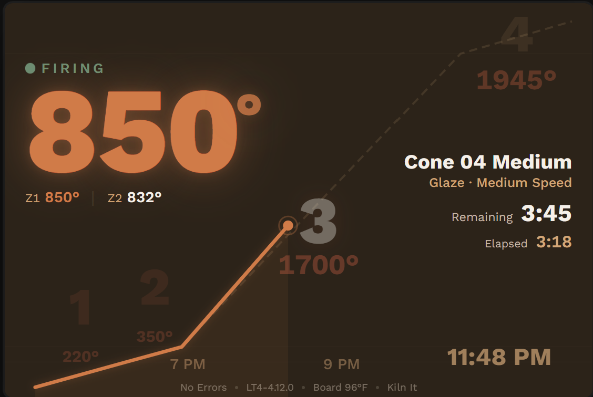
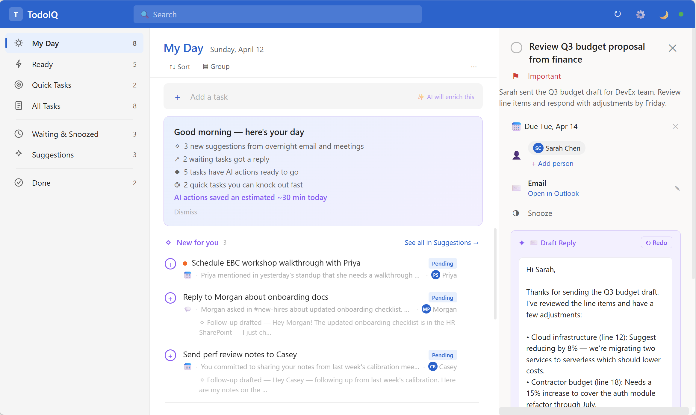
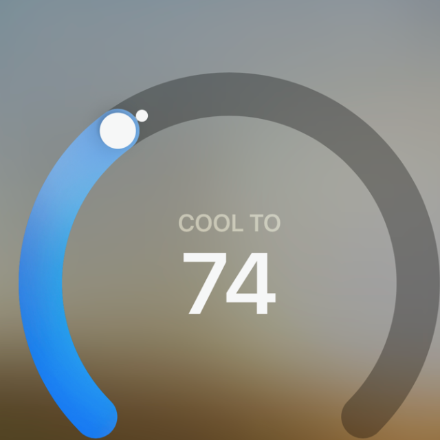
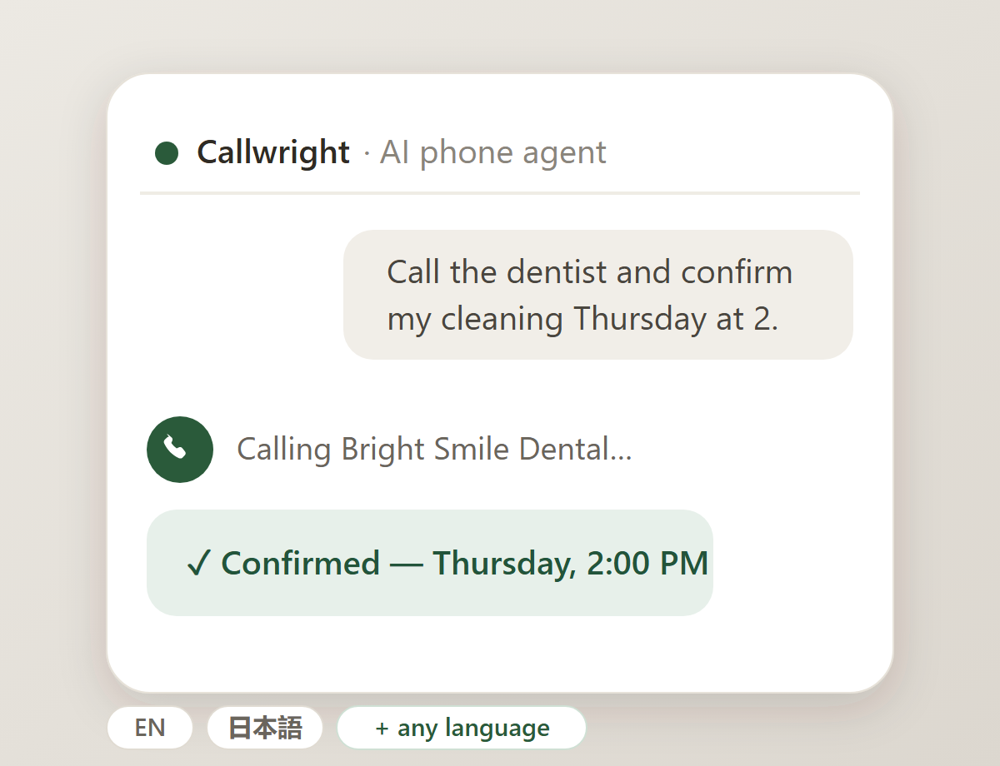
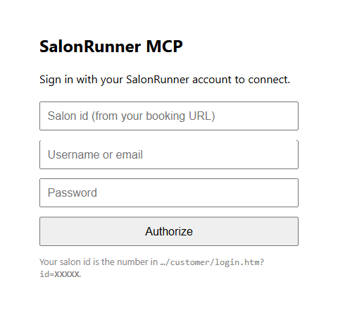

# Phil Topness

I build tools at the intersection of AI, real-time data, and delightful UX — mostly to scratch my own itch, often ending up as something others can use too.

 

<table>
<tr>
<td width="300"></td>
<td>
<h3><a href="https://crowdhum.com">CrowdHum</a></h3>
🌐 Live &nbsp; 🧪 Beta
  
Live audience engagement — physics-animated polling where votes become glowing spheres, plus dynamic word clouds with AI clustering. No app install — scan a QR code and watch results materialize on screen. Built for speakers, facilitators, and storytellers.
</td>
</tr>
</table>

<table>
<tr>
<td width="300"></td>
<td>
<h3><a href="https://mcpstation.io">MCP Station</a></h3>
🌐 Live &nbsp; 🧪 Beta
  
A catalog and factory for MCP servers. Generate mock servers from a prompt, sample data, or OpenAPI spec — plus browse pre-built servers and agent recipes. Deploy to Copilot Studio, Claude Desktop, or Cursor. <strong>Free for anyone to use at hackathons.</strong>
</td>
</tr>
</table>

<table>
<tr>
<td width="300"></td>
<td>
<h3><a href="https://replaylane.com">ReplayLane</a></h3>
🌐 Live &nbsp; 🧪 Beta
  
Turn any screen recording into an interactive click-through demo. Upload a video and get a shareable HTML simulation — viewers click through each step at their own pace. Great for product walkthroughs, training, and docs.
</td>
</tr>
</table>

<table>
<tr>
<td width="300"></td>
<td>
<h3><a href="https://kilnsense.com">KilnSense</a></h3>
🌐 Live &nbsp; 🧪 Beta
  
Real-time kiln monitoring for ceramic artists. Sign in with your KilnAid account to track temperature, firing schedule, and kiln status from any browser.
</td>
</tr>
</table>

<table>
<tr>
<td width="300"></td>
<td>
<h3><a href="https://wordsync.app">WordSync</a> &nbsp; </h3>
🌐 Live
  
German language learning via Deutsche Welle's slowly-spoken news — word-by-word audio highlighting with tap-to-translate. Powered by Whisper + DeepL, updated daily, hosted for free.
</td>
</tr>
</table>

<table>
<tr>
<td width="300"></td>
<td>
<h3><a href="https://aka.ms/adoptionpulse">AdoptionPulse</a></h3>
🌐 Live
  
AI adoption maturity assessment that guides organizations through a decision-tree questionnaire to evaluate AI readiness across a three-phase model — Empower, Reshape, and Reinvent.
</td>
</tr>
</table>

<table>
<tr>
<td width="300"></td>
<td>
<h3>FlightView &nbsp; </h3>
 
Raspberry Pi kiosk app tracking aircraft overhead via OpenSky Network. Two themes — vintage Solari split-flap board and modern Heathrow signage — for 7" and 10" touchscreens.
</td>
</tr>
</table>

<table>
<tr>
<td width="300"></td>
<td>
<h3>TodoIQ &nbsp; </h3>
 
AI-powered task manager that scans Microsoft 365 — Teams, meetings, flagged emails — to surface actionable to-dos. System-tray app with web dashboard, backed by Claude and WorkIQ MCP.
</td>
</tr>
</table>

<table>
<tr>
<td width="300"></td>
<td>
<h3>OrionSleep &nbsp; </h3>
 
Brings the Orion Sleep mattress topper into Apple HomeKit. A Hubitat driver plus Postman collection that reverse-engineer the bed's API for temperature and thermal-relief ("hot flash") control — so a physical button can warm, cool, or trigger relief on either side of the bed.
</td>
</tr>
</table>

<table>
<tr>
<td width="300" align="center">☀️  <strong>Hubitat</strong></td>
<td>
<h3>Hubitat Solar Shade Controller &nbsp; </h3>
 
Derived-sunlight automation for exterior shades. Combines solar position, Open-Meteo radiation, facade geometry, and dwell-gated hysteresis to safely control multiple one-way Somfy RTS/Bond shades.
</td>
</tr>
</table>

<table>
<tr>
<td width="300"></td>
<td>
<h3>Callwright &nbsp; </h3>
 
A voice agent that places real phone calls on my behalf, shaped by an LLM's direction and grounding. Ask your assistant to "book a table for four Friday at 7," "confirm the repair appointment in my calendar," or "call this shop and ask if they have it in stock," and it makes the call — disclosing that it's an AI, negotiating only within bounds I set, never fabricating, and reporting back. It can even <strong>book a reservation in a language I don't speak</strong>: English and Japanese out of the box, with any other language added on the fly (translated prompt + a native voice). Built on Retell and exposed as a hosted <strong>MCP server</strong>, so any assistant (Claude, ChatGPT, Copilot) can drive it; it learns the details it was missing from each call and re-dials an unanswered call once.
</td>
</tr>
</table>

<table>
<tr>
<td width="300"></td>
<td>
<h3>SalonRunner MCP &nbsp; </h3>
 
A self-hosted <strong>MCP server</strong> that books salon appointments through SalonRunner — the booking system my hair salon uses. Ask your assistant to "find a haircut next Tuesday with my usual stylist" or "cancel my Friday appointment," and it lists services and stylists, finds real availability, and books or cancels on my behalf. It reverse-engineers the SalonRunner client API and is exposed to <strong>claude.ai</strong> as a remote connector — you sign in with your salon login on a consent screen, your credentials are encrypted into the token (so authorization survives scale-to-zero), and one deployment can serve any salon on SalonRunner.
</td>
</tr>
</table>
