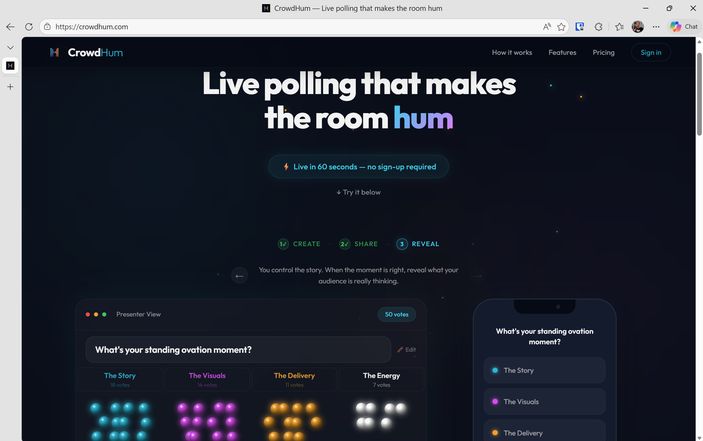
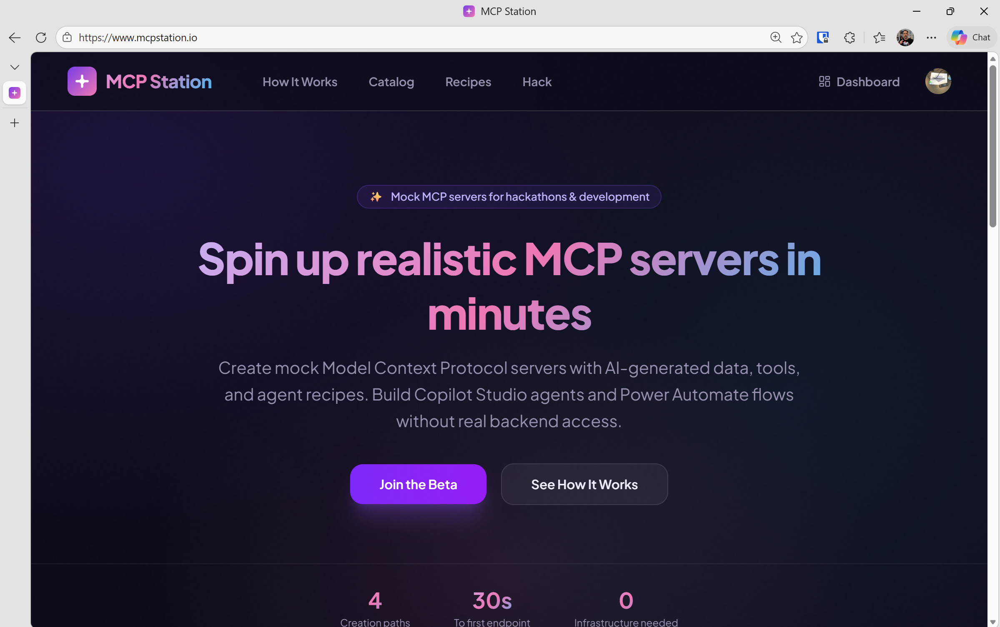
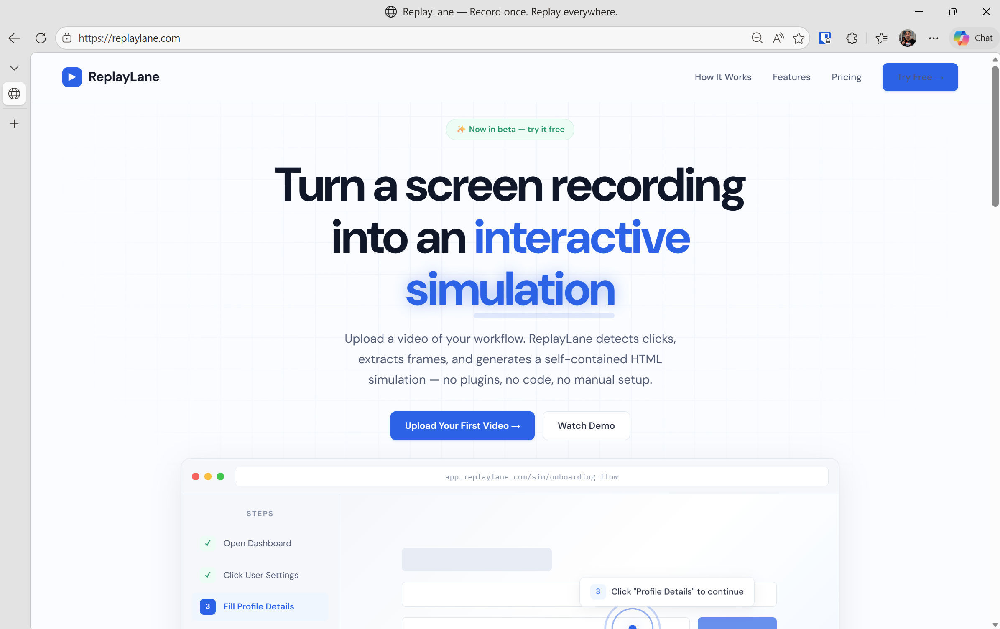
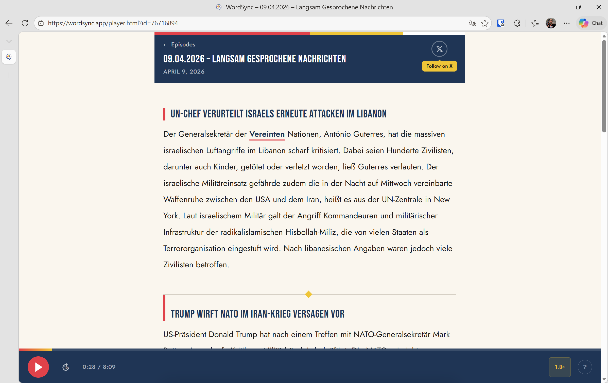
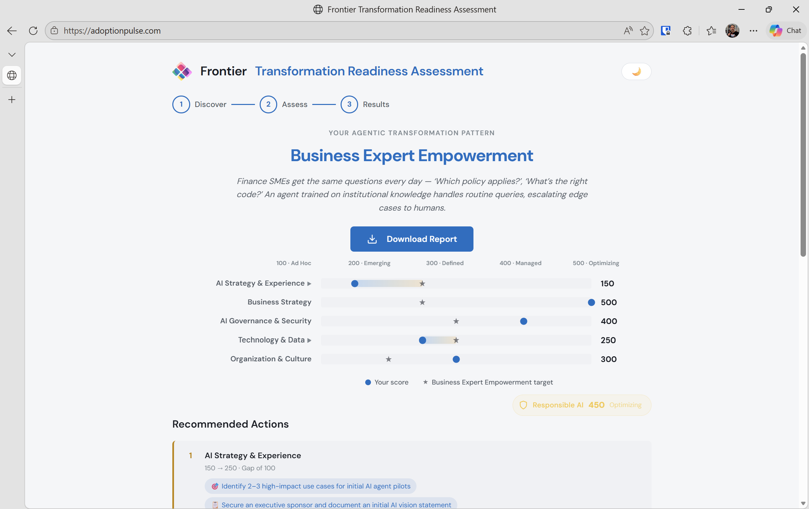
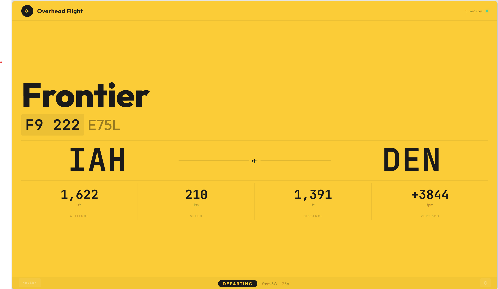
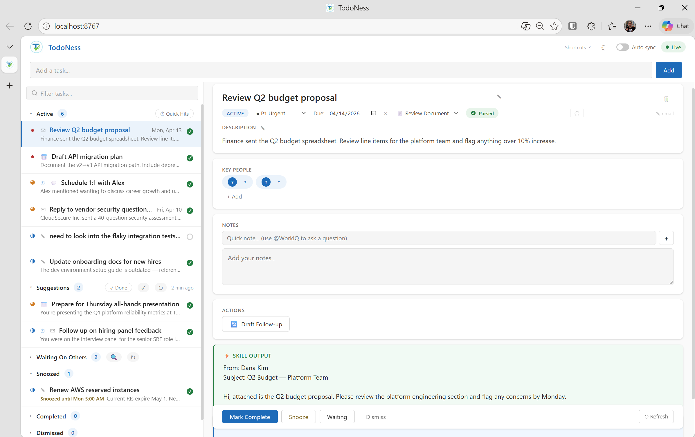

# Phil Topness

I build tools at the intersection of AI, real-time data, and delightful UX — mostly to scratch my own itch, often ending up as something others can use too.

 

<table>
<tr>
<td width="300"></td>
<td>
<h3><a href="https://crowdhum.com">CrowdHum</a></h3>
🌐 Live &nbsp; 🧪 Beta
  
Live audience polling where votes become physics-animated glowing spheres. No app install — scan a QR code, vote, and watch results materialize on screen.
</td>
</tr>
</table>

<table>
<tr>
<td width="300"></td>
<td>
<h3><a href="https://mcpstation.io">MCP Station</a></h3>
🌐 Live &nbsp; 🧪 Beta
  
A catalog and factory for MCP servers. Generate mock servers from a prompt, sample data, or OpenAPI spec — plus browse pre-built servers and agent recipes. Deploy to Copilot Studio, Claude Desktop, or Cursor. <strong>Free for anyone to use at hackathons.</strong>
</td>
</tr>
</table>

<table>
<tr>
<td width="300"></td>
<td>
<h3><a href="https://replaylane.com">ReplayLane</a></h3>
🌐 Live &nbsp; 🧪 Beta
  
Converts screen recordings into interactive click-through simulations. Analyzes cursor movement, detects clicks, transcribes narration, and outputs a shareable static HTML site.
</td>
</tr>
</table>

<table>
<tr>
<td width="300"></td>
<td>
<h3><a href="https://wordsync.app">WordSync</a> &nbsp; </h3>
🌐 Live
  
German language learning via Deutsche Welle's slowly-spoken news — word-by-word audio highlighting with tap-to-translate. Powered by Whisper + DeepL, updated daily, hosted for free.
</td>
</tr>
</table>

<table>
<tr>
<td width="300"></td>
<td>
<h3><a href="https://adoptionpulse.com">AdoptionPulse</a></h3>
🌐 Live
  
AI adoption maturity assessment that guides organizations through a decision-tree questionnaire to evaluate AI readiness across a three-phase model — Empower, Reshape, and Reinvent.
</td>
</tr>
</table>

<table>
<tr>
<td width="300"></td>
<td>
<h3>FlightView &nbsp; </h3>
 
Raspberry Pi kiosk app tracking aircraft overhead via OpenSky Network. Two themes — vintage Solari split-flap board and modern Heathrow signage — for 7" and 10" touchscreens.
</td>
</tr>
</table>

<table>
<tr>
<td width="300"></td>
<td>
<h3>TodoNess &nbsp; </h3>
 
AI-powered task manager that scans Microsoft 365 — Teams, meetings, flagged emails — to surface actionable to-dos. System-tray app with web dashboard, backed by Claude and WorkIQ MCP.
</td>
</tr>
</table>

